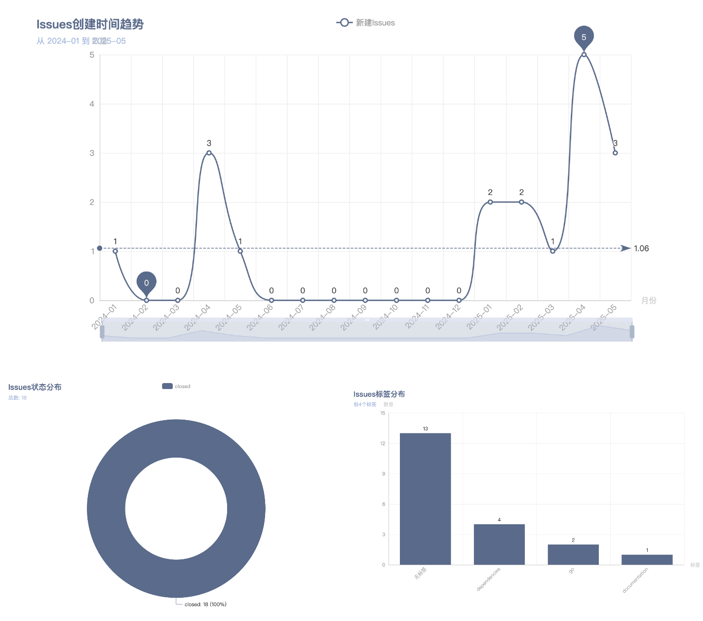

# Issue2File

<a href=""></a>
[](https://github.com/ibarryyan/issue2file/stargazers)
<a href=""></a>

一个用Go语言编写的GitHub Issue导出工具，可以将指定GitHub仓库的所有Issue以Markdown格式保存到本地，并支持AI分析总结、生成图表功能。

<p style="text-align: center;">

</p>

## 功能特性

- 支持从当前Git仓库自动获取GitHub仓库信息
- 支持直接指定GitHub仓库地址
- 将所有Issue（包括已关闭的）导出为Markdown文件
- 包含Issue的完整信息：标题、状态、创建者、时间、标签、指派人等
- 支持GitHub API认证，避免API限制
- 支持使用AI生成Issues分析总结报告
- 支持生成图表

## 安装

### 从源码编译

```bash
git clone https://github.com/ibarryyan/issue2file
cd issue2file
go mod tidy
go build -o issue2file
```

### 直接运行

```bash
go run .
```

## 使用方法

### 基本用法

```bash
# 从当前目录的Git仓库获取Issues
./issue2file .

# 从指定仓库获取Issues（简短格式）
./issue2file owner/repo

# 从完整URL获取Issues
./issue2file https://github.com/owner/repo
```

### 高级选项

```bash
# 使用AI生成Issues分析总结
./issue2file owner/repo --ai

# 指定输出目录
./issue2file owner/repo --output ./my-issues

# 指定AI分析总结文件名
./issue2file owner/repo --ai --filename issues-analysis.md

# 使用配置文件
./issue2file -config=./config.cnf owner/repo
```

### 配置文件

你可以使用TOML格式的配置文件（.cnf后缀）来设置所有选项：

```toml
# GitHub和AI令牌
github_token = "your_github_token"
ai_token = "your_ai_token"

# 功能开关
comments = true
ai_summary = false
charts = false

# 输出设置
output_dir = "output_directory"
summary_file = "summary.md"
```

项目中提供了一个示例配置文件 `config.example.conf`，你可以复制并修改它：

```bash
cp config.example.conf config.cnf
# 编辑 config.cnf 文件设置你的配置
```

### 设置GitHub Token（推荐）

为了避免GitHub API的限制，建议设置GitHub Personal Access Token：

```bash
export GITHUB_TOKEN=your_github_token_here
```

### 设置AI API Token（使用AI功能时需要）

如果要使用AI分析功能，需要设置AI API Token：

```bash
export AI_TOKEN=your_ai_token_here
```

## GitHub Token 获取方法

1. 登录GitHub，进入 Settings > Developer settings > Personal access tokens
2. 点击 "Generate new token"
3. 选择适当的权限（至少需要 `public_repo` 权限）
4. 复制生成的token并设置为环境变量

## 输出格式

工具会在当前目录创建一个名为 `issues_owner_repo` 的文件夹，其中包含所有Issue的Markdown文件。

每个Issue文件的命名格式为：`issue_编号_标题.md`

文件内容包括：
- Issue基本信息（编号、状态、创建者、时间等）
- 标签和指派人信息
- Issue的完整描述内容
- GitHub链接

如果启用了AI分析功能，还会生成一个总结文件（默认为`summary.md`），包含：
- AI生成的Issues分析总结
- Issues列表概览

## 示例

```bash
$ ./issue2file xxx/xxx
正在获取仓库 xxx/xxx 的issues...
已保存 issue #1: Welcome to xxx
已保存 issue #2: Feature request: xxx
...
完成！共保存了 150 个issues到目录: issues_xxx_xxx
```

使用AI分析：

```bash
$ ./issue2file xxx/xxx --ai true 
正在获取仓库 xxx/xxx 的issues...
已保存 issue #1: Welcome to xxx
...
正在使用AI生成分析总结...
完成！共保存了 150 个issues到目录: issues_xxx_xxx
AI分析总结已保存到: issues_xxx_xxx/summary.md
```

## 常见问题

### Q: API限制怎么办？
A: 设置GITHUB_TOKEN环境变量，可以大大提高API限制。

### Q: 如何获取GitHub Token？
A: 
1. 登录GitHub
2. 进入 Settings > Developer settings > Personal access tokens
3. 生成新token，至少需要 `public_repo` 权限

### Q: 支持私有仓库吗？
A: 支持，但需要设置有相应权限的GitHub Token。

### Q: 程序运行很慢？
A: 大型仓库的Issue数量可能很多，请耐心等待。程序会显示进度。

### Q: AI分析功能需要什么条件？
A: 需要设置AI_TOKEN环境变量，并使用`--ai-summary`参数启用该功能。

## 注意事项

- 如果不设置GitHub Token，API调用会有限制（每小时60次）
- 大型仓库可能有很多Issue，导出时间较长
- 确保有足够的磁盘空间存储导出的文件
- AI分析功能需要网络连接和有效的API Token

## TODO 

- [x] 优化AI接入，引入Langchain支持更多模型
- [x] 优化日志打印
- [x] 优化AI分析issue质量和准确率
- [x] prompt工程化

## 欢迎关注我


有问题或建议可以提交[issue](https://github.com/ibarryyan/issue2file/issues/new)，也可以微信公众号进行留言

## 请作者喝杯咖啡


## 致谢

感谢[JetBrains](https://www.jetbrains.com)提供的IDE支持

## 许可证

[MIT License](LICENSE)

## Star History

[](https://www.star-history.com/#ibarryyan/issue2file&Date)
