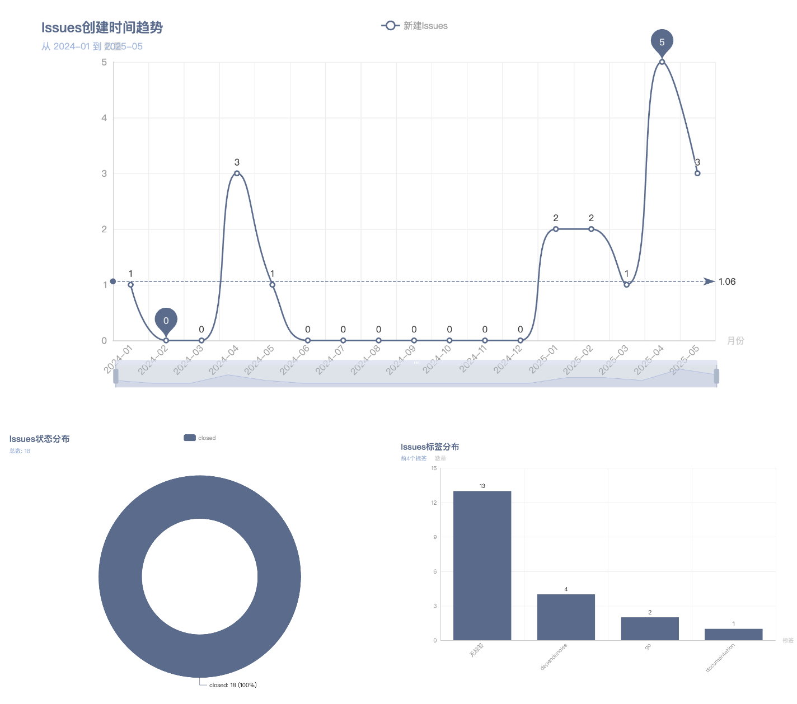

# Issue2File

<a href=""></a>
[](https://github.com/ibarryyan/issue2file/stargazers)
<a href=""></a>

一个用Go语言编写的GitHub Issue导出工具，可以将指定GitHub仓库的所有Issue以Markdown格式保存到本地，并支持AI分析总结、生成图表功能。

<p style="text-align: center;">

</p>

## 功能特性

- 支持从当前Git仓库自动获取GitHub仓库信息
- 支持直接指定GitHub仓库地址
- 将所有Issue（包括已关闭的）导出为Markdown文件
- 包含Issue的完整信息：标题、状态、创建者、时间、标签、指派人等
- 支持GitHub API认证，避免API限制
- 支持使用AI生成Issues分析总结报告
- 支持生成图表
- **支持生成可视化面板**（KPI 指标 + 交互式图表 + 可搜索/筛选/排序的 Issue 明细表）
- 支持以本地 Web 服务方式浏览产出（`-serve`）
- 自动过滤 Pull Request，保证统计口径只针对真实 issue

## 安装

### 从源码编译

```bash
git clone https://github.com/ibarryyan/issue2file
cd issue2file
go mod tidy
go build -o issue2file
```

### 直接运行

```bash
go run .
```

## 使用方法

### 基本用法

```bash
# 从当前目录的Git仓库获取Issues
./issue2file .

# 从指定仓库获取Issues（简短格式）
./issue2file owner/repo

# 从完整URL获取Issues
./issue2file https://github.com/owner/repo
```

### 高级选项

```bash
# 使用AI生成Issues分析总结
./issue2file owner/repo --ai

# 指定输出目录
./issue2file owner/repo --output ./my-issues

# 指定AI分析总结文件名
./issue2file owner/repo --ai --filename issues-analysis.md

# 使用配置文件
./issue2file -config=./config.cnf owner/repo

# 生成可视化面板（默认开启，产出 dashboard.html）
./issue2file owner/repo

# 导出后启动本地服务，用浏览器打开面板
./issue2file owner/repo -serve
./issue2file owner/repo -serve -port 9000

# 关闭可视化面板
./issue2file owner/repo -dashboard=false

# 把 Pull Request 也一起导出（默认过滤）
./issue2file owner/repo -includePR
```

> 参数顺序不敏感：`issue2file owner/repo -ai` 与 `issue2file -ai owner/repo` 等价。

### 可视化面板

导出完成后（`-dashboard` 默认开启），输出目录下会生成：

| 文件 | 说明 |
|------|------|
| `dashboard.html` | 单文件面板，数据已内嵌，**直接双击用浏览器打开即可**，无需起服务 |
| `issues.json` | 结构化数据集，可被其他脚本消费或二次渲染 |

面板包含：

- **KPI 指标**：Issue 总数、未关闭/已关闭数量与占比、平均关闭耗时、未结平均存活天数、参与人数、标签数
- **状态分布**：环形图
- **标签 TOP 10**：横向柱状图
- **月度新建 / 关闭趋势**：月度少于等于 24 个月时用并列柱状，超过则自动切成折线；同时叠加「累计存量」曲线（虚线，右轴）
- **创建者 TOP 10**：横向柱状图
- **Issue 明细表**：支持关键词搜索（标题/作者/标签）、状态筛选、标签筛选、按任意列排序、分页

统计口径说明：GitHub 的 `/issues` 接口会把 Pull Request 一并返回，面板默认按 `IsPullRequest()` 过滤，
如需保留可加 `-includePR`。注意过滤同时作用于 Markdown 导出与图表。

### 以 Web 服务方式浏览

`-serve` 会在导出完成后启动一个只读的本地 HTTP 服务（默认 `127.0.0.1:8080`），按 `Ctrl+C` 优雅退出：

```bash
$ ./issue2file owner/repo -serve
面板已启动： http://127.0.0.1:8080/dashboard.html
数据集接口： http://127.0.0.1:8080/api/issues.json
服务目录：   /path/to/issues_owner_repo
按 Ctrl+C 退出
```

该服务同时是整个输出目录的静态文件服务，因此也可以直接浏览导出出来的 Markdown 文件。

### 配置文件

你可以使用TOML格式的配置文件（.cnf后缀）来设置所有选项：

```toml
# GitHub和AI令牌
gitHubToken = "your_github_token"
aiToken = "your_ai_token"

# AI 设置
aiModel   = "deepseek-chat"
aiBaseURL = "https://api.deepseek.com/v1/chat/completions"

# 功能开关（未出现在配置文件中的项，会沿用命令行/默认值）
commentEnable   = true   # 是否下载 issue 评论
aiEnable        = false  # 是否使用 AI 分析
chartEnable     = true   # 是否生成 go-echarts 图表
dashboardEnable = true   # 是否生成可视化面板
includePR       = false  # 是否把 PR 也当作 issue 导出

# 本地 Web 服务
serve = false
port  = 8080

# 输出设置
outputDir   = "issues_output"
summaryFile = "summary.md"
```

> 配置文件中的布尔项为「显式声明才生效」。没有写进配置文件的开关不会覆盖命令行参数，
> 因此 `-ai` 这类命令行开关不会被配置文件静默关掉。

项目中提供了一个示例配置文件 `config.example.conf`，你可以复制并修改它：

```bash
cp config.example.conf config.cnf
# 编辑 config.cnf 文件设置你的配置
```

### 设置GitHub Token（推荐）

为了避免GitHub API的限制，建议设置GitHub Personal Access Token：

```bash
export GITHUB_TOKEN=your_github_token_here
```

### 设置AI API Token（使用AI功能时需要）

如果要使用AI分析功能，需要设置AI API Token：

```bash
export AI_TOKEN=your_ai_token_here
```

## GitHub Token 获取方法

1. 登录GitHub，进入 Settings > Developer settings > Personal access tokens
2. 点击 "Generate new token"
3. 选择适当的权限（至少需要 `public_repo` 权限）
4. 复制生成的token并设置为环境变量

## 输出格式

工具会在当前目录创建一个名为 `issues_owner_repo` 的文件夹，目录结构如下：

```
issues_owner_repo/
├── dashboard.html          # 可视化面板（双击即可打开）
├── issues.json             # 结构化数据集
├── issue_1_如何安装？.md    # 每个 Issue 一个 Markdown 文件
├── issue_2_....md
├── summary.md              # AI 分析总结（-ai 时生成）
└── charts/                 # go-echarts 图表（-chart 时生成）
    ├── index.html
    ├── status_chart.html
    ├── labels_chart.html
    └── timeline_chart.html
```

每个Issue文件的命名格式为：`issue_编号_标题.md`

文件内容包括：
- Issue基本信息（编号、状态、创建者、时间等）
- 标签和指派人信息
- Issue的完整描述内容
- GitHub链接

如果启用了AI分析功能，还会生成一个总结文件（默认为`summary.md`），包含：
- AI生成的Issues分析总结
- Issues列表概览

## 示例

```bash
$ ./issue2file xxx/xxx
正在获取仓库 xxx/xxx 的issues...
已过滤 87 个 Pull Request，剩余 294 个 issue
已保存 issue #1: Welcome to xxx
已保存 issue #2: Feature request: xxx
...
完成！共保存了 294 个issues到目录: issues_xxx_xxx
正在生成可视化面板...
可视化面板已生成: issues_xxx_xxx/dashboard.html（数据集: issues_xxx_xxx/issues.json）
```

使用AI分析：

```bash
$ ./issue2file xxx/xxx --ai true 
正在获取仓库 xxx/xxx 的issues...
已保存 issue #1: Welcome to xxx
...
正在使用AI生成分析总结...
完成！共保存了 150 个issues到目录: issues_xxx_xxx
AI分析总结已保存到: issues_xxx_xxx/summary.md
```

## 常见问题

### Q: API限制怎么办？
A: 设置GITHUB_TOKEN环境变量，可以大大提高API限制。

### Q: 如何获取GitHub Token？
A: 
1. 登录GitHub
2. 进入 Settings > Developer settings > Personal access tokens
3. 生成新token，至少需要 `public_repo` 权限

### Q: 支持私有仓库吗？
A: 支持，但需要设置有相应权限的GitHub Token。

### Q: 程序运行很慢？
A: 大型仓库的Issue数量可能很多，请耐心等待。程序会显示进度。

### Q: AI分析功能需要什么条件？
A: 需要设置AI_TOKEN环境变量，并使用`--ai-summary`参数启用该功能。

## 注意事项

- 如果不设置GitHub Token，API调用会有限制（每小时60次）
- 大型仓库可能有很多Issue，导出时间较长
- 确保有足够的磁盘空间存储导出的文件
- AI分析功能需要网络连接和有效的API Token

## 开发

```bash
go build ./...
go vet ./...
go test ./...
```

单元测试覆盖了面板数据聚合口径（KPI 计算、PR 过滤、月度补零与累计存量）、
文件名清洗、原子写盘以及命令行参数重排等纯逻辑，不依赖网络。

## TODO 

- [x] 优化AI接入，引入Langchain支持更多模型
- [x] 优化日志打印
- [x] 优化AI分析issue质量和准确率
- [x] prompt工程化
- [x] 可视化面板（dashboard.html / issues.json）
- [x] 本地 Web 服务浏览产出（-serve）
- [ ] 大仓库并发拉取评论（errgroup 限流）
- [ ] GitHub API 限流重试与退避

## 欢迎关注我


有问题或建议可以提交[issue](https://github.com/ibarryyan/issue2file/issues/new)，也可以微信公众号进行留言

## 请作者喝杯咖啡


## 致谢

感谢[JetBrains](https://www.jetbrains.com)提供的IDE支持

## 许可证

[MIT License](LICENSE)

## Star History

[](https://www.star-history.com/#ibarryyan/issue2file&Date)
